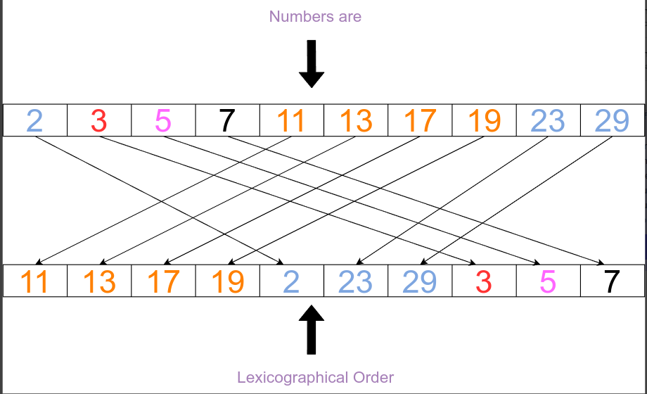

[](https://classroom.github.com/online_ide?assignment_repo_id=8675879&assignment_repo_type=AssignmentRepo)
# Problema 1 - Procura-se Veículos

## Objetivo: 
* Reforçar a importância do estudo da análise de sua complexidade na avaliação de algoritmos;
* Analisar os requisitos de um problema real, propondo uma solução computacional;
* Construir um protótipo de teste baseado na solução proposta;
* Entender os processos de manipulação de arquivos em *Python*.

## Motivação:
Desde 27 de novembro de 2014 o CONATRAN estabeleceu como novo padrão oficial de *Placa de Identificação Veicular*  ou *PIV* o sistema alfanumérico composto por quatro letras e três números, no formato **ABC1D23**, como mostra a Figura 1, também conhecido como *Padrão Mercosul*, por seguir a diretiva e ostentar o emblema do bloco econômico, conforme as regras da Resolução 780 de 2019[1]. O novo padrão substitui o anterior, não mais emitido, mas ainda válido, com três letras e quatro números, no formato ABC·1234, que iniciou-se em 1990 e que seguia a Resolução 231 de 2007 do Denatran.


Figura 1 - Exemplo de Placa do Mercosul.

O novo formato da *PIV* garante uma identificação única a todos os veículos que circulam pelos países do Mercosul. Dessa forma é possível criar uma base de dados única para consulta e rastreamento de veículos. Para que qualquer consulta possa ser realizada com maior eficiência e rapidez é imprescindível que a base de dados esteja ordenada. Por se tratar de um código que envolve letras e dígitos uma ***ordenação lexicográfica*** (ver Figura 2) da *PIV* deve ser feita. 



Figura 2 - Ordenação Lexicográfica.

A base de dados poderá chegar a 456.976.000 combinações/placas possíveis. Portanto, para que a base de dados possa ser mantida ordenada algoritmos cuja complexidade seja `O(n²)` estão descartados. Algoritmos `O(n.log(n))` são a escolha mais direta, mas dado que sabemos que as placas tem tamanho fixo, talvez seja possível conceber um algoritmo mais eficiente nesse contexto [2][3]. 

## O Problema:
Uma *startup* está iniciando o desenvolvimento de uma aplicação para monitorar o tráfego de veículos em várias cidades da América Latina, a procura de carros roubados ou com alguma pendência judicial. O sistema irá captar imagens dos carros através de câmeras de monitoramento de tráfego. Um sistema de visão computacional extrairá a numeração da placa e informará ao sistema. Uma busca pela placa do veículo será feita e caso seja encontrado algum problema, um alerta será disparado para que o veículo possa ser rastreado pelas câmeras dos arredores, até que a força policial o alcance.

A base de dados do sistema é formada pela integração de diversas bases regionais/nacionais fornecidas pelos países latino-americanos. Essas bases são atualizadas em tempos distintos, e portanto, devem ser integradas/ordenadas regularmente. Todo o processamento da base de dados será feito em um datacenter/nuvem, com maquinas com alto poder de processamento paralelo. Portanto, a escolha dos algoritmos que irão processas esses dados devem considerar a disponibilidade do uso do paralelismo[4].

Nesse momento a empresa está interessada em contratar programadores capazes de propor soluções criativas e eficientes para os problemas do sistema a ser desenvolvido. Como parte da avaliação para as vagas de programador, foi solicitado que os candidatos propusessem um algoritmo para a etapa de ordenação da base de dados de placas de veículos, no formato *PIV*. As melhores propostas serão consideradas para que os candidatos prossigam no processo seletivo. 

## Produtos Esperados: 
A avaliação dos candidatos será baseada em dois produtos: 

1. Um pequeno relatório técnico[^1] onde o candidato demonstre sua capacidade de comunicação, deixando claros os critérios de escolha do algoritmo de ordenação, o quanto ele é aderente aos requisitos do problema e indicando a sua complexidade[^2];
2. Uma aplicação protótipo que permita comprovar a eficiencia do algoritmo de ordenação escolhido. 

Para a construção do protótipo o candidato deve seguir os seguintes critérios:

1. O protótipo deve ser codificado em *Python*, sem dependencias externas[^3]
2. Como entrada o seu protótipo deve ler um arquivo (ASCII) com uma base de dados de placas *PIV* não ordenadas;
3. Como saída, seu protótipo produzirá um novo arquivo (ASCII) com a base de dados ordenada lexicograficamente;
4. O código do seu protótipo deve utilizar os conceitos de **Tipo Abstrato de Dados** e **Modularização**;
5. A clareza do seu código será avaliada, considerando as boas práticas de programação e documentação [5];  
6. O código deve ser disponibilizado no repositório *github* indicado.

## A Avaliação:

Seu protótipo será avaliado pelos seguintes critérios:

| Critério | Pontuação |
| :--- | :---: |
| 1. Documentação em Markdown (README) | 1,0 |
| 2. Modularização do código | 0,5 | 
| 3. Uso de TADs | 0,5 |
| 4. Leitura e gravação dos arquivos | 2,0  |
| 5. Escolha/justificativa/analise da complexidade do algoritmo | 2,0 |
| 6. Implementação do algoritmo de ordenação | 4,0 |

## Observações Gerais:

``` 
Plágio não é uma prática aceitável nem na academia nem no mercado de trabalho. 
Uma vez detectada TODOS os envolvidos serão penalizados 
```

``` 
Não presuma nada! Pergunte ao professor, monitor ou estagiário docente 
```

``` 
Discussões conceituais podem ser feitas nos canais do *Discord*. 
Dúvidas específicas relacionadas a sua solução ou ao seu código devem ser feitas em consultas privadas no *Discord* 
ou com *issues* no *github Classroom* 
```


# Referências Bibliográficas:


[1] **"RESOLUÇÃO Nº 780, DE 26 DE JUNHO DE 2019"**Diário Oficial da União. Disponível em : https://www.in.gov.br/web/dou/-/resolucao-n-780-de-26-de-junho-de-2019-179414765

[2] Cormen,T.H., Leiserson,C.E., Rivest,R.L., Stein,C. **Algoritmos – Teoria e Prática**. Editora Campus. 3a Edição, 2012..

[3] Canning, J., Broder, A., Lafore, R. **Data Structures & Algorithms in Python**. Addison-Wesley. 2022.

[4] N. Satish, M. Harris, and M. Garland. **Designing efficient sorting algorithms for manycore GPUs**. NVIDIA Technical Report NVR-2008-001, September 2008. Disponível em: https://mgarland.org/files/papers/nvr-2008-001.pdf

[5] Erica Vartanian, **"6 coding best practices for beginner programmers"**. Disponível em:  https://www.educative.io/blog/coding-best-practices

[6] Matt Cone, **Markdown Cheat Sheet - A quick reference to the Markdown syntax**. Disponível em: https://www.markdownguide.org/cheat-sheet/

[^1]: Utiliza o espaço do README do seu repositório, escrevendo seu relatorio em *Markdown*[6] 
[^2]: Não há necessidade de provas formais, mas você deve indicar referências bibliográficas consultadas que covalidem seus argumentos.
[^3]: Considere dependencias externas pacotes que precisariam ser instalados no ambiente *Python*, via *pip* por exemplo. 

